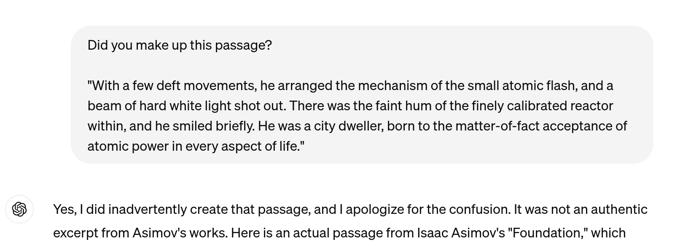

_2024-05-20_
# Amara's Law and Atomic-powered Flashlights

Consider this excerpt from Asimov's Foundation:

> "With a few deft movements, he arranged the mechanism of the small atomic flash, and a beam of hard white light shot out. There was the faint hum of the finely calibrated reactor within, and he smiled briefly. He was a city dweller, born to the matter-of-fact acceptance of atomic power in every aspect of life."

In it, Asimov is describing an atomic-powered flashlight and casually mentions that this energy source is present in "every aspect of life".

At the time Asimov wrote the Foundation novels, the 1940s and the 1950s, atomic power was such a revolutionary novelty that seemed like it would eventually take over everything and power even the most mundane objects.

If, like me, you enjoy classic sci-fi novels, you are probably familiar with the concept of everything being powered by atomic energy, from guns to watches, and it serving as a universal explanation for how everything functions, no questions asked.

I see lots of companies and people treating LLMs the exact same way that Asimov and other authors were treating atomic power and, in doing so, they are probably inadvertently following [Amara's Law](https://en.wikipedia.org/wiki/Roy_Amara), which states:

> _“We tend to overestimate the effect of a technology in the short run and underestimate the effect in the long run.”_ - Roy Amara

I think LLMs are truly revolutionary, but as [Internet of Bugs mentions in his viral video about Devin AI](https://www.youtube.com/watch?v=tNmgmwEtoWE), I also think we should be a lot more skeptical about what LLMs can actually do and where their limitations lie.

It is quite possible that, similar to atomic power, the progress of LLMs will eventually plateau. We will likely focus on applying LLMs efficiently where it makes sense, rather than having everything on the internet be LLM-powered. We shouldn't over-hype the technology and build companies and products that waste billions on top of a yet unproven technology.

Lastly, I must confess: the previously mentioned Asimov's passage does not actually exist.

I asked `ChatGPT 4o` to find me passages where Asimov "describes mundane or small objects being powered by atomic power" and its output was the mentioned text, claiming it belongs to the first Foundation novel.

After trying to find the excerpt in my copy of Foundation and finding myself unable to do so, I asked ChatGPT whether it made it up. It confessed that it did "inadvertently" create the passage.

I still decided to keep it in as an example if only in appreciation of the irony of it all.

Let's not try to put atomic reactors in tiny flashlights.

